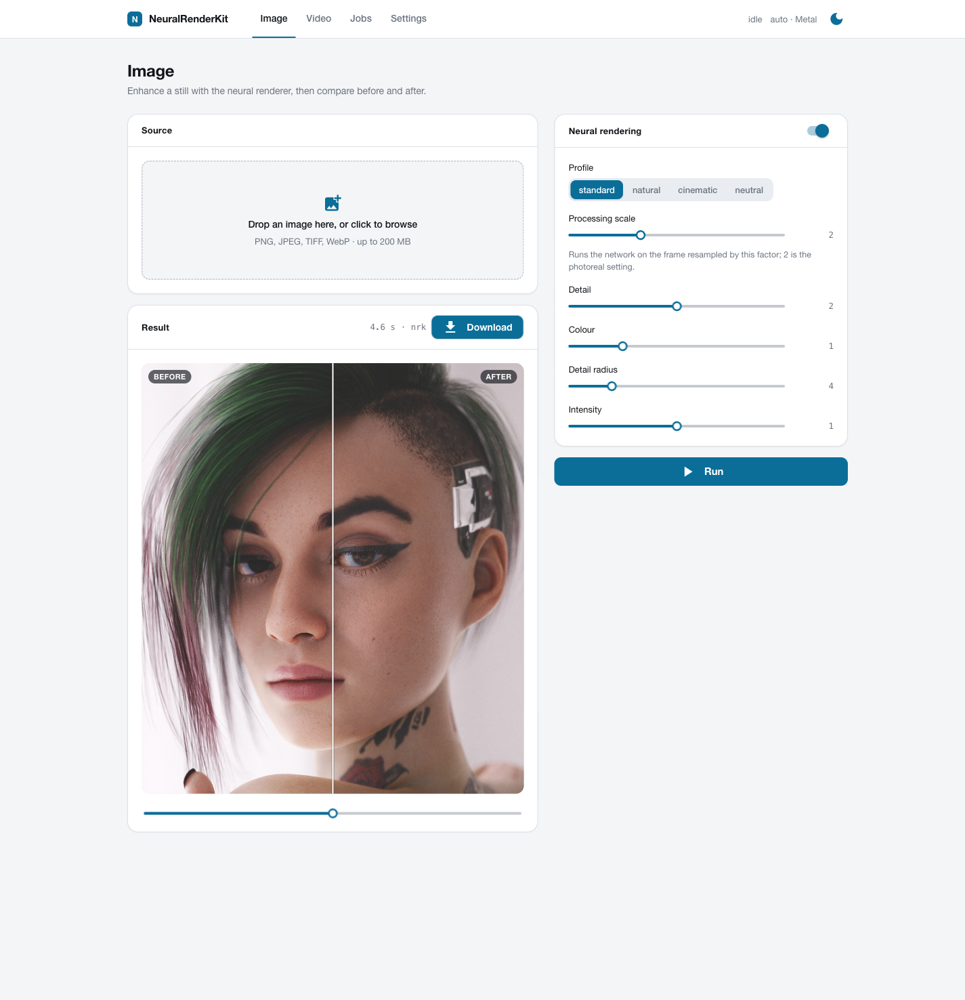

# MLX-DLSS

> [!TIP]
> **A note for the NVIDIA reader.** This port was worked out on a laptop and on
> GPU instances rented by the hour, some of which even booted. A pair of DGX
> Sparks would have replaced the rentals and would have a steady job here:
> experiments like this one, and the pet projects queued behind it. Hit me up on
> X: [@WaveCut](https://x.com/WaveCut).

**What this is.** NVIDIA ships two neural networks inside DLSS: the DLSS 5
neural renderer, which makes game frames look more photoreal (detail, colour,
tone), and the frame generator, which interpolates frames. Both are locked to
RTX cards and to games that call DLSS. This project runs them anywhere else:
on stills and video, on Apple Silicon first (MLX and Metal), on any machine
through PyTorch, and as a Core ML export.

**How it was done.** The networks were recovered from the libraries by reading
their kernels and comparing every intermediate tensor against captures from
the real thing. The neural renderer lands within 0.005 MAE of the DLL on game
renders; the frame generator matches the library at 59.9 dB. Half of the work
was not the math but the rounding: FP8, half floats, an approximate softmax
and a hash-based noise generator all had to be reproduced bit for bit.

**What you need.** Your own copies of `nvngx_dlssnr.dll` and
`libnvidia-ngx-dlssg.so`; the weight tool extracts the tensors locally.
Nothing proprietary is included, downloaded or redistributed.

**What it is not.** Not real-time in games, not a drop-in DLSS, not affiliated
with or endorsed by NVIDIA. DLSS Super Resolution was measured and
deliberately left out: without engine motion vectors it loses to plain Lanczos.

## This fork (Bambushu/MLX-DLSS)

Everything upstream, plus what was needed to use the two networks on real and AI footage:

- **Fine-tuned renderer weights** (`scripts/finetune.py`): the recovered graph trains as-is; the
  stock weights add pores only to already-sharp stills, the fine-tunes add them to soft sources
  (AI video, phone footage). Section below.
- **Skin auto-mask** (`--auto-mask skin`): face parsing fills the network's per-pixel skin channels,
  so skin detail lands on skin and hair/background keep their own texture.
- **Scene-cut gate** for frame generation and the temporal renderer (`--scene-cut`): a hard cut is
  held instead of blended.
- **High-pass history blend** (`--hp-history 0.5`) for video: removes static shimmer at ~5% detail.
- **ComfyUI node pack** (`comfyui/ComfyUI-MLX-DLSS`, five nodes + example workflows).
- **Metal backend on Command Line Tools** (prebuilt metallib), 17x the PyTorch path on video.
- **`scripts/validate.py`**: withheld-frame PSNR against RIFE 4.7 / 4.26 / minterpolate, renderer
  sharpness and static-vs-moving flicker. Every number is in `ab/RESULTS.md`.


Neural rendering on a 1408×1600 game render, 1:1 crop: input, defaults, `--processing-scale 2 --detail-strength 2`.

https://github.com/user-attachments/assets/ce94f426-910b-4556-bdf9-662cbdd5933a

Frame generation: even frames in, generated frames out, the withheld frames for comparison.

## Requirements

- Python 3.10+ (macOS, Linux, Windows); PyTorch is installed as a dependency.
- Video: `ffmpeg` and `ffprobe` in `PATH`; optical-flow temporal mode: `pip install './python[video]'`.
- Metal backend: macOS 14+, Xcode with Swift 6.2, CMake, Ninja.
- Core ML packages: `pip install './python[coreml]'` (macOS or Linux).
- Web front end: `pip install './python[web]'`.

## Weights

| network | source file | command | output |
| --- | --- | --- | --- |
| neural rendering | `nvngx_dlssnr.dll` (file version 310.8.0.0, SHA-256 `ceb6432f…2650`; the `e16bcf15…` build of the same version extracts identically, 649 tensors) | `mlxdlss-weights all nvngx_dlssnr.dll weights/ [--coreml 320x320]` | `weights/dlssnr-weights-logical.safetensors` (PyTorch), `weights/NeuralRendering.dlssmodel` (Metal), `weights/NeuralRendering-WxH-float16.mlpackage` (Core ML) |
| frame generation | `libnvidia-ngx-dlssg.so.310.7.0` (DLSS SDK 310.7.0) | `mlxdlss-weights extract-fg libnvidia-ngx-dlssg.so.310.7.0 weights/framegen.safetensors` | `weights/framegen.safetensors` (both backends) |

`mlxdlss-weights sha256 FILE` reports whether a DLL is a known checkpoint;
`mlxdlss-weights inspect PACKED` lists the tensors of an unknown version.

## Install and build

```sh
python -m pip install './python[web,video]'
swift build -c release && scripts/prepare-mlx-metallib.sh "$(swift build -c release --show-bin-path)"   # macOS, Metal backend
```

The second command is required after every clean Swift build: it places
`mlx.metallib` next to the `mlxdlss` binary. Compiling that metallib needs the Metal
compiler (full Xcode); on Command Line Tools point the script at the prebuilt one from the
`mlx` pip wheel of the SAME version as the mlx-swift checkout (0.31.1 here):
`MLXDLSS_METALLIB=…/site-packages/mlx/lib/mlx.metallib scripts/prepare-mlx-metallib.sh "$(swift build -c release --show-bin-path)"`
(`MLXDLSS_SKIP_TESTS=1` skips the XCTest build the script otherwise runs). MLX is the primary backend;
PyTorch runs the same graph on any machine; Core ML is an export with a fixed
extent.

## Commands

Still images:

```sh
mlxdlss-torch run --weights weights/dlssnr-weights-logical.safetensors --input in.png --output out.png   # PyTorch: --device auto|cpu|cuda|mps, --precision reference|fast
.build/release/mlxdlss render-image in.png weights/NeuralRendering.dlssmodel --output out.png --execution metal-fused --precision float16
.build/release/mlxdlss render-image in.png weights/NeuralRendering-320x320-float16.mlpackage --output out.png --backend coreml --compute-units cpu-gpu
```

Core ML packages have a fixed extent: a 256×256 image runs on the 320×320
package, 1080p needs 1920×1088. Raw float32 NHWC tensors:
`mlxdlss run MODEL --input in.f32 --input-format rgb-first-frame --width W --height H --output out.f32`,
`mlxdlss-torch run --input in.f32 --width W --height H`.

Frame generation:

```sh
.build/release/mlxdlss framegen a.png b.png --weights weights/framegen.safetensors --output between.png   # --factor 3|4 writes between-1.png …; --phase 0.25
mlxdlss-video framegen in.mp4 out.mp4 --weights weights/framegen.safetensors                       # frame rate x2, audio copied
mlxdlss-video framegen in.mp4 out.mp4 --weights weights/framegen.safetensors --backend mlxdlss         # Metal through mlxdlss framegen-stream; --batch 4 pairs per pass
mlxdlss-video framegen in.mp4 slow.mp4 --weights weights/framegen.safetensors --mode slowmo --factor 4 --audio stretch
```

`--mode fps` multiplies the frame rate and keeps the duration; `--mode slowmo`
keeps the rate and stretches the clip. `--scene-cut 0.15` (default) holds a pair
whose mean luma change exceeds the threshold as a hard cut at the midpoint instead of
blending two unrelated frames; `0` disables. `--audio copy|stretch|none`: `stretch`
(slow motion only) uses FFmpeg `atempo`, pitch preserved.

Video through the neural renderer:

```sh
mlxdlss-video convert in.mp4 out.mp4 --backend mlxdlss --model weights/NeuralRendering.dlssmodel --temporal --encode-args "-c:v libx265 -crf 20 -preset slow"
mlxdlss-video convert in.mp4 out.mp4 --weights weights/dlssnr-weights-logical.safetensors --device cuda --batch 4 --processing-scale 2 --detail-strength 2
mlxdlss-video convert in.mp4 clip.mp4 --weights ... --start-frame 300 --frames 120 --decode-args "-vf scale=1280:-2"
mlxdlss-video probe in.mp4
mlxdlss-video compare in.mp4 out.mp4          # original | processed side by side in mpv
```

`--temporal` reprojects the previous output with motion (OpenCV DIS optical
flow, or engine motion through the Python API) and blends it with the learned
history weight; `--scene-cut` resets the history on a luma jump. Default
encoding: `-c:v libx264 -crf 18 -preset medium -pix_fmt yuv420p -movflags +faststart`;
`--pix-fmt rgb48le` keeps 16-bit sources; `--status-interval` seconds between
progress lines. Temporal mode runs at the native scale.

Web front end:

```sh
mlxdlss-web        # http://127.0.0.1:8181; --port, --no-browser, --native (pywebview window), --root DIR
```

Pages: Image (before/after slider), Video (effect chain: neural rendering and
frame generation in either order; the result plays in place, a side-by-side
comparison with the original is one click away), Jobs (queue, progress,
cancel, downloads), Settings (weight paths, backend, device, theme). Jobs run
one at a time; results are stored under `~/MLX-DLSS/outputs/<job>/`.
HTTP API: `GET /api/effects`, `POST /api/jobs` (multipart `file` + JSON
`effects`), `GET /api/jobs[/{id}]`, `POST /api/jobs/{id}/cancel`,
`GET /api/jobs/{id}/output/{n}` (inline), `GET /api/jobs/{id}/download/{n}`,
`GET /api/jobs/{id}/preview` (side by side).

<p>
  <a href="docs/assets/web-image.png"></a>
  <a href="docs/assets/web-video.png"></a>
</p>
<p>
  <a href="docs/assets/web-jobs.png"></a>
</p>

Image: a 1280×1440 face crop rendered on Metal in 4.6 s at processing scale 2,
detail 2; drag the divider. Video: the converted clip plays in place, «Side by
side» shows it next to the original. Jobs: every result with its download,
the comparison clip and the folder.

## Fine-tuned weights (this fork)

`scripts/finetune.py` trains the recovered graph as-is: a straight-through estimator on every
E4M3 rounding, an FP8 envelope barrier that keeps activations inside the range the network was
shipped for, self-supervised soft→sharp pairs from real photographs (FFHQ-1024 filtered for
sharpness + LSDIR, degradation = x264/JPEG/phone-noise mixture calibrated on real H3 frames and
RealSR), loss = low-pass L1 + high-pass L1 + local high-pass energy + DINOv2 perceptual, with
optional multi-scale Laplacian + anti-halo/anti-mottle hinges, synthetic-flow temporal consistency
and a band-limited PatchGAN (`--w-lap`, `--w-temporal`, `--w-adv`).

| weights | character | use |
| --- | --- | --- |
| `dlssnr-ft-real-v2` | honest: same detail on soft faces, leaves sharp content alone, least flicker | default for video |
| `dlssnr-ft-real-v1-crisp` | punchy: more edge definition, a little more shimmer | stills, or when v2 reads too soft |
| `dlssnr-ft-real-v1` | conservative first run | reference |

They drop into every `--weights` flag and into `mlxdlss-weights mlx` for the Metal package.
Recipe for soft sources: processing scale 1, **detail 2** (1 is a barely visible pass on production H3 output, 3 shows grain), colour 1, `--auto-mask skin`, and
`--hp-history 0.5` on video (scale 2 makes the fine-tunes SOFTER, unlike stock). Keep the stock
weights (scale 2, colour 0.5) for already-sharp stills. The weights are derived from the vendor's
and are not in this repository. `scripts/finetune.py build|train|eval|calibrate` reproduces them
from your own extraction (`scripts/fetch_datasets.py` pulls the datasets).

## ComfyUI

`comfyui/ComfyUI-MLX-DLSS` wraps both networks as nodes (renderer with the skin auto-mask,
frame generation with the scene-cut gate, Image/Video Upscale = resampler or any spandrel
upscale model for the pixels + the renderer for the detail) and ships `example_workflows/`. See its README.

Which pixels to feed the re-detail pass was measured on twelve production clips at 1.5x with the
original frame as truth (`scripts/upscale_bake.py`, `ab/RESULTS.md`): Thera (arbitrary-scale,
[ComfyUI-Thera](https://github.com/yuvraj108c/ComfyUI-Thera)) is the best source on fidelity and
perceived quality, Lanczos second and the node default; learned 2x/4x nets (SPAN, ClearReality,
Real-ESRGAN) lose 10+ dB to the truth and triple the halo, so they are the wrong input for it.

## Controls (neural rendering)

| option (`mlxdlss run` / `mlxdlss-torch run` / `mlxdlss-video convert`) | default | effect |
| --- | --- | --- |
| `--profile standard\|natural\|cinematic\|neutral` | `standard` | style index and local tone/structure preset |
| `--processing-scale 1–4` | `1` | run the network on the frame resampled by this factor (memory and time grow with its square) |
| `--detail-strength 0–8`, `--colour-strength 0–4`, `--detail-radius` | `1`, `1`, `4` | `result = input + colour·lowpass(change) + detail·highpass(change)` |
| `--intensity 0–1` | `1` | blend of the enhanced result over the input |
| `--control-mask rgb.f32` | none | red: blend, green: tone, blue: structure, per pixel |
| `--auto-mask skin`, `--mask-floor 0–1`, `--mask-feather px` | `none`, `0`, `8` | face-parsing model (`pip install './python[mask]'`) fills the network's skin/automatic-mask channels per pixel, so the skin-specific detail lands on face skin and hair/background keep their own texture; floor = mask value outside skin; `--save-mask` writes it. Also on `mlxdlss-video convert` (torch backend) |
| `--noise-frame-index` | `0` | deterministic noise seed; sessions advance it per frame |
| `--hp-history 0–1` (video, `--temporal`) | `0` | photometrically gated blend of the previous output's high-pass into the current one: 0.5–0.7 removes static shimmer for ~5% detail; a pixel that changed more than 15/255 gets no history |
| `--noise-mode fresh\|frozen\|zero\|advected` (video) | `fresh` | how the noise channels evolve per frame; measured a no-op on the recovered graph, kept for experiments |

## Python API

```python
from mlxdlss import NeuralRenderingPipeline, TemporalSession, FrameGenerator
pipeline = NeuralRenderingPipeline.from_safetensors("weights/dlssnr-weights-logical.safetensors", device="auto")
result = pipeline.enhance(image_float32_hwc, profile="standard", processing_scale=2, detail_strength=2)
session = TemporalSession(pipeline)           # frame sequences; session.process(frame[, motion=engine_uv_offsets])
generator = FrameGenerator.from_safetensors("weights/framegen.safetensors", device="auto")
middle = generator.generate(frame_a_uint8, frame_b_uint8, factor=2)[0]   # factor-1 frames at phases k/factor
```

## Accuracy and speed

| component | measurement |
| --- | --- |
| Neural rendering, Metal | `0.004–0.005` MAE against the NVIDIA DLL on 1152–1408 px game renders |
| Neural rendering, PyTorch | within `0.002` MAE of the Metal port; ~8 s per 1440×1280 frame on an M2 Max (MPS, reference graph) |
| Neural rendering, memory | PyTorch: about `1 GB` per megapixel of network input at float32 (1080p `2.0 GB`, 2560×2880 `5.5 GB`), half of that with `--precision fast`; the graph is evaluated in bounded chunks, so the peak does not depend on window count (`MLXDLSS_TORCH_CHUNK_TOKENS` sets the chunk, `0` disables). Metal: `2.2 GB` resident for a 3840×2160 frame |
| Neural rendering, Core ML | `0.008–0.014` MAE against the DLL |
| Temporal path | Swift and Python agree within `0.0014` MAE per frame; against NVIDIA on a 64-frame static sequence: `0.0054` MAE (`42.3` dB) with the same drift from frame 0 as the vendor; motion, jitter and mask cases not captured |
| Frame generation | reproduces the library's output at `59.9` dB PSNR (max 3/255) on captured frames; five whole clips within `0.01–0.03` dB of the library (27.4–38.9 dB against withheld frames) |
| Frame generation, speed (M2 Max, 960×540 / 1920×1080) | Metal float16 `6.3 / 21` ms per frame on the GPU, `6.4 / 25` ms through `mlxdlss-video framegen --backend mlxdlss`; PyTorch/MPS float16 `5.3 / 17` ms |
| `mlxdlss stream` (video, Metal) | about 11 fps at 512×448 on an M2 Max end to end (ffmpeg, optical flow and the pipe included; features generated on the GPU), identical to `mlxdlss run-sequence` |

Not included: DLSS Super Resolution (measured, loses to Lanczos on realistic
content without engine motion vectors and jitter; see the note below) and the
frame generator's motion-vector, depth, HUD and inpainting inputs (no-ops for
plain video).

## Documentation

- [Frame generation](docs/frame-generation.md): graph, verification, speed.
- [Super resolution](docs/super-resolution.md): measured, not ported.
- [Embedding guide](docs/embedding.md): the Swift API.
- [Recovery notes](docs/recovery-notes.md): package format, recovered graph, measured errors.
- [Research notes](docs/research/): kernel captures and the preprocessor.

## Development

```sh
scripts/verify.sh                                                  # Swift tests, Python tests, public-tree audit
python -m unittest discover -s python -t python -p 'test_*.py'     # Python package tests only
SWIFTPM_MAXIMUM_CONCURRENT_JOBS=2 swift test                       # Swift tests only
scripts/audit-public-tree.sh .                                     # no DLLs, weights or captures in the tree
```

CI runs the Swift suite on macOS and the Python package on macOS, Linux and
Windows. The audit rejects executable binaries, CUDA fatbins, DLL and weight
files, large unreviewed files and absolute home paths; `weights/` and `.build/`
are ignored and must never be committed. See [SECURITY.md](SECURITY.md),
[CONTRIBUTING.md](CONTRIBUTING.md), [PUBLICATION.md](PUBLICATION.md) and
[NOTICE](NOTICE).

## License

Apache License 2.0 for the source. Model packages built from vendor libraries
keep the vendor's terms; do not redistribute them.
